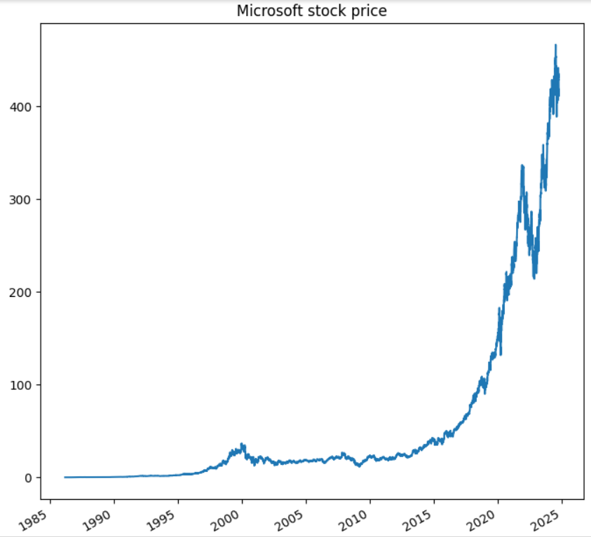

# **Stock Prediction Using Sentiment Scores from Tweets**

## **Overview**
This project aims to predict stock market movements based on sentiment analysis of tweets related to specific stocks or companies. By analyzing the sentiment of social media data (e.g., Twitter), the model attempts to forecast whether a stock's price will go up or down.
This project leverages sentiment analysis on Twitter data to predict stock market movements.



## **Objective**
To build a machine learning model that predicts stock movement (up or down) based on sentiment scores derived from Twitter data. The sentiment scores are used as features to predict stock market trends, with the ultimate goal of improving stock movement predictions.

## **Dataset**
The dataset consists of two primary components:
1. **Twitter Data**: Collected tweets about specific stocks or companies.
2. **Stock Data**: Historical stock prices (open, close, high, low, volume, etc.).

### **Features**:
- **Sentiment Score**: A numeric value derived from the sentiment analysis of each tweet (ranging from negative to positive sentiment).
- **Stock Movement**: The target variable representing whether the stock price goes up or down (binary classification: 0 for no movement or down, 1 for up).

## **Project Structure**
- **`1000 tweets.csv`**: Contains the raw Twitter data and stock data.
- **`Stock_Prediction.ipynb`**: Gooogle colab notebook conatins all code for stck prediction.
- **`data_scraping_twitter_stocks.ipynb`**: Data scraping code from twitter.
- **`README.md`**: Instructions and project overview (this file).
  
## **Installation Instructions**
### **Requirements**:
- Python 3.x
- Libraries: `pandas`, `numpy`, `scikit-learn`, `nltk`, `transformer`,`matplotlib`, `ntscraper`, `yfinance`, `Plotly`

### **Installation Steps**:
1. Clone this repository:
   ```bash
   git clone https://github.com/your-repo-url/stock-prediction-sentiment.git
## **Challenges**
- **`Data Imbalance`**:The dataset may contain more "no movement" or "down" predictions than "up," leading to bias in the model. Techniques like resampling or class weights were used to address this issue..
- **`SData Quality`**:  Tweets often contain noisy data (e.g., slang, misspellings), requiring preprocessing steps such as tokenization, stop-word removal, and text cleaning.
## **Model Accuracy**


 
